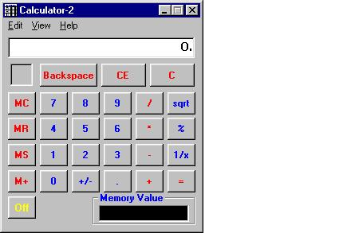



## Calculator\-2

### Description

This is a carbon copy of the Microsoft Calculator really, it functions just like it. I owe a great deal to Mr. Ian Williams for his help on coding much of this. I have added a few other functions or enhancements that some of the other Calculator applications have on them. The Scientific portion still needs to be coded.
 
### More Info
 
Works like a Calculator.

             |
---                |---
**Submitted On**   |2001-10-17 22:34:40
**By**             |[Robert Gross](https://github.com/Planet-Source-Code/PSCIndex/blob/master/ByAuthor/robert-gross.md)
**Level**          |Beginner
**User Rating**    |4.4 (31 globes from 7 users)
**Compatibility**  |VB 5\.0, VB 6\.0
**Category**       |[Complete Applications](https://github.com/Planet-Source-Code/PSCIndex/blob/master/ByCategory/complete-applications__1-27.md)
**World**          |[Visual Basic](https://github.com/Planet-Source-Code/PSCIndex/blob/master/ByWorld/visual-basic.md)
**Archive File**   |[Calculator2960810172001\.zip](https://github.com/Planet-Source-Code/robert-gross-calculator-2__1-28196/archive/master.zip)

